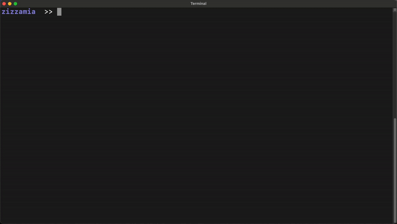

# [Build Onchain Apps](https://github.com/coinbase/build-onchain-apps/)

> Build onchain applications with the best consumer experience in a few minutes. ☕️

[](https://github.com/coinbase/build-onchain-apps/blob/main/CHANGELOG.md) [](https://www.npmjs.com/package/@coinbase/build-onchain-apps) [](https://github.com/coinbase/build-onchain-apps/graphs/contributors) [](https://github.com/coinbase/build-onchain-apps/stargazers) [](https://github.com/coinbase/build-onchain-apps/blob/main/LICENSE)

<br />

**Build Onchain Apps** takes an opinionated approach to streamlining and automating early decisions you must make in building your consumer product.

The onchain app generated by the CLI aims to be a companion that walks alongside you over the first few months of building.

So, if you are either a hackathon participant and/or an ambitious entrepreneur aiming to establish the next successful company, this is built with you in mind. 💙

<br />

Out of the box 🧰 🧙 ✨

- Web2 building blocks: [Next.js](https://nextjs.org/) + [Tailwind CSS](https://tailwindcss.com/) + [Radix UI](https://www.radix-ui.com/) 🟡
- Onchain building blocks: [Base](https://base.org/) + [RainbowKit](https://www.rainbowkit.com) + [wagmi](https://wagmi.sh/) + [Viem](https://viem.sh/) 🔵
- Onchain UI components: [AccountConnectButton](https://github.com/coinbase/build-onchain-apps/blob/main/apps/build-onchain-apps/src/onchainkit/components/AccountConnectButton.tsx) 🎨
- Support EOA Wallet integration 👛
- Linting and Prettier 💅
- Tests Suite
- Support Progressive Web Apps ⚡️
- Foundry integration
- _Client Analytics (Coming Soon)_
- _Web Vitals optimization (Coming Soon)_
- _In-depth step by step documentation (Coming Soon)_
- _One click deploy on Vercel_
- _Onchain UI components: Balances, Minting, Airdrop, etc..._
- _We just started; stay tuned for more to come!!! ☕️_

<br >

## Getting Started

#### Step 1: Kick off your onchain app

```bash
npx @coinbase/build-onchain-apps@latest create
```

<p align='center'>
  
</p>

#### Step 1.1: Obtain Wallet Connect Project ID from [walletconnect.com](https://cloud.walletconnect.com/sign-in) and assign to the `.env.local` file

```bash
NEXT_PUBLIC_WALLET_CONNECT_PROJECT_ID=ADD_WALLET_CONNECT_PROJECT_ID_HERE
```

#### Step 1.2: Install and Run your onchain app

```bash
# Install dependencies
yarn

# Run onchain app
yarn dev
```

<p align='center'>
  
</p>

#### Step 2: Kick start your contracts

```bash
# Initialize git
git init

# Install Foundry

curl -L https://foundry.paradigm.xyz | bash
foundryup
```

#### Step 2.1: Build, test and format the sample contracts

```bash
cd contracts

# Install openzeppelin
forge install
forge install openzeppelin/openzeppelin-contracts --no-commit
forge remappings > remappings.txt

# Build
forge build

# Test
forge test

# Format
forge fmt
```

#### Step 2.3: Deploy contracts to Base goerli

Create a `.env` file using the `.env.example` file provided in your contracts folder and add your private key.

```bash
source .env

forge script script/BuyMeACoffee.s.sol:BuyMeACoffeeScript --broadcast --verify --rpc-url ${RPC_URL} --etherscan-api-key ${BLOCK_EXPLORER_API_KEY}
```

#### _Congrats ✨, Time to enjoy your onchain app with some coffee ☕️_

<br>

## For a Live demo use
- [Stackblitz](https://stackblitz.com/github/coinbase/build-onchain-apps/tree/main/apps/build-onchain-apps)

<br>

## Contributing ☕️ 🔵

The main purpose of this repository is to continue evolving Build Onchain Apps, making it better and easier to use. Development of Build Onchain Apps happens in the open on GitHub, and we are grateful to the community for contributing bugfixes and improvements. Read below to learn how you can take part in improving Build Onchain Apps.

### [Code of Conduct](CODE_OF_CONDUCT.md).

Build Onchain Apps has adopted a Code of Conduct that we expect project participants to adhere to. Please read the full text so that you can understand what actions will and will not be tolerated.

### [Contributing Guide](CONTRIBUTING.md).

Read our contributing guide to learn about our development process, how to propose bugfixes and improvements, and how to build and test your changes to Build Onchain Apps.

### Develop

To build and test either the CLI or the main App, start by cloning the repo.

```bash
# Clone the repo
git clone https://github.com/coinbase/build-onchain-apps.git
```

### Develop the App

```
# Go to main application
cd apps/build-onchain-apps

# Install and run latest template
yarn
yarn dev
```

### Develop the CLI

```
# From the root repo
# Install and build latest dependencies
yarn
yarn build

# Link the local package to the global npm registry
npm link

# Test CLI using the local package
build-onchain-apps create

# After testing, unlink the package from the global npm registry
npm unlink @coinbase/build-onchain-apps
npm uninstall -g @coinbase/build-onchain-apps
```

<br>

## Community ☁️ 🌁 ☁️

Building Onchain Applications is all about community, whether you are ready for a hackathon or building your next company; for any questions, feel free to:

1. open an [issue](https://github.com/coinbase/build-onchain-apps/issues/new?assignees=&labels=type%3A+documentation&projects=&template=documentation_request.yml&title=Documentation+Request%3A+) and ask a question here on GitHub;
2. reach out to the maintainers on Twitter: [@zizzamia](https://twitter.com/Zizzamia), [@alvaroraminelli](https://twitter.com/alvaroraminelli), [@snoopies_eth](https://twitter.com/snoopies_eth), [@wespickett](https://twitter.com/wespickett), [@renanmav](https://twitter.com/renanmav), [@codyrnova](https://twitter.com/codyrnova)
3. let us know [what project you build](https://github.com/coinbase/build-onchain-apps/discussions/64) with this library.

<br>

## License

This project is licensed under the MIT License - see the [LICENSE.md](LICENSE.md) file for details
