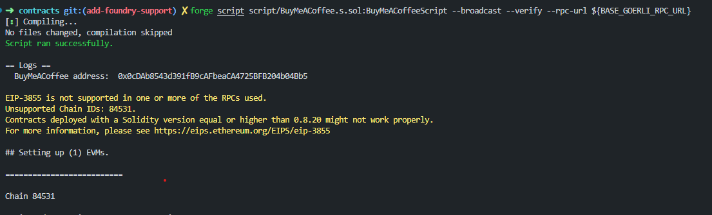
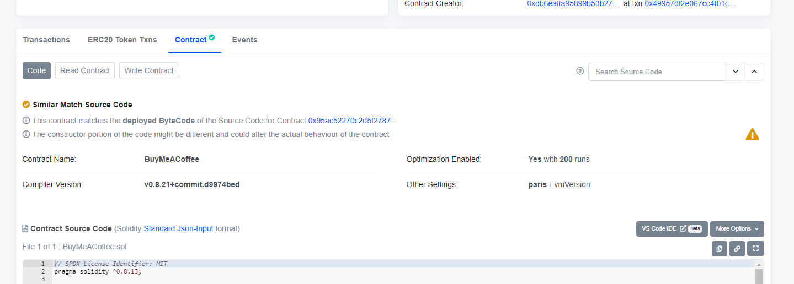

## Contracts

This project is built using Foundry. For more information, visit the docs [here](https://book.getfoundry.sh/)

## Introduction

This repository contains a sample `BuyMeACoffee.sol` contract which allows the user to buy the owner a coffee with `0.001 ether`. Along with that the user can send the owner a memo.

## Project Layout

```

.
├── foundry.toml
├── script
│   └── BuyMeACoffee.s.sol
├── src
│   └── BuyMeACoffee.sol
└── test
    └── BuyMeACoffee.t.sol

```

- You can configure Foundry's behavior using foundry.toml.
- The default directory for contracts is src/.
- The default directory for tests is test/
- The default directory for writing scripts is script/

## Usage

### Installation

Install foundry using

```shell
curl -L https://foundry.paradigm.xyz | bash
foundryup
```

### Build

```shell
$ forge build
```

### Test

```shell
$ forge test
```

### Format

```shell
$ forge fmt
```

### Deploy to Base Goerli

Create a `.env` file using the `.env.example` file provided.

```shell
$ source .env
$ forge script script/BuyMeACoffee.s.sol:BuyMeACoffeeScript --broadcast --verify --rpc-url https://goerli.base.org --etherscan-api-key ${BASESCAN_API_KEY}
```





Forge runs your solidity script. In that script it tries to broadcast the transaction. It writes it back into the broadcast folder in a run-latest.json file. **It will also automatically verify your contract on Goerli BaseScan**. Learn more about scripting from [here](https://book.getfoundry.sh/tutorials/solidity-scripting)

### ABI

To extract the `abi` of your contract, you can go to `out/BuyMeACoffee.sol/BuyMeACoffee.json` and copy the value corresponding to the `abi` key
