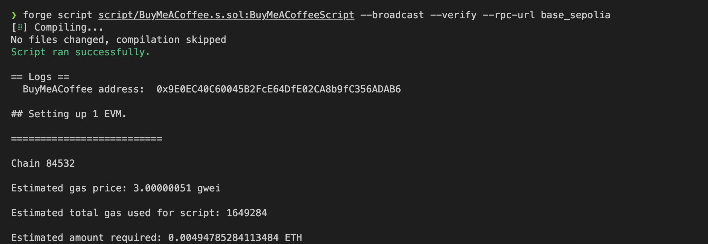

## Contracts

This project is built using Foundry. For more information, visit the docs [here](https://book.getfoundry.sh/)

# Disclaimer

The provided Solidity contracts are intended solely for educational purposes and are
not warranted for any specific use. They have not been audited and may contain vulnerabilities, hence should
not be deployed in production environments. Users are advised to seek professional review and conduct a
comprehensive security audit before any real-world application to mitigate risks of financial loss or other
consequences. The author(s) disclaim all liability for any damages arising from the use of these contracts.
Use at your own risk, acknowledging the inherent risks of smart contract technology on the blockchain.

# Contents

- [Introduction](#introduction)
- [Project Layout](#project-layout)
- [Usage](#usage)
- [Deploying your own contract](#deploying-your-own-contract)
- [Contributing](#contributing)

## Introduction

### Contracts

#### BuyMeACoffee

This repository contains a sample `BuyMeACoffee.sol` contract which allows the user to buy the owner a coffee with `0.001 ether`. Along with that the user can send the owner a memo.

#### CustomERC1155

It also contains a sample implementation (`CustomERC1155.sol`) of ERC1155 using openzeppelin's [ERC1155 contract](https://github.com/OpenZeppelin/openzeppelin-contracts/blob/master/contracts/token/ERC1155/IERC1155.sol)

#### SignatureMintERC721

Contract that allows a user to mint a ERC721 for free with a cryptographically signed message. This is useful for mints where you want to allow users to mint for free based on a signature from
your backend API. This is an alternative approach to a merkel tree which is fully on-chain. [ERC721 contract](https://github.com/OpenZeppelin/openzeppelin-contracts/blob/master/contracts/token/ERC721/IERC721.sol).
Also makes use of the following helper libraries for signature verification:

1. [OpenZeppelin MessageHashUtils](https://github.com/OpenZeppelin/openzeppelin-contracts/blob/master/contracts/utils/cryptography/MessageHashUtils.sol) - Used to mimic web3 signatures.
2. [OpenZeppelin ECDSA](https://github.com/OpenZeppelin/openzeppelin-contracts/blob/master/contracts/utils/cryptography/ECDSA.sol) - Used to validate signatures are authentic.

For this contract to work, you need to create a wallet which will act as the signer, you can do this in your
favorite EOA wallet or code:

```js
const wallet = ethers.Wallet.createRandom();
console.log(wallet.privateKey);
console.log(wallet.address);
```

That wallet address needs to be imported as an environment parameter in the contracts project. This is needed
because the signer is set during contract deployment: `SIGNATURE_MINT_SIGNER="0xAddress`

### Project Layout

```
.
├── foundry.toml
├── script
│   └── BuyMeACoffee.s.sol
│   └── CustomERC155.s.sol
├── src
│   └── BuyMeACoffee.sol
│    └── CustomERC155.sol
└── test
    └── BuyMeACoffee.t.sol
    └── CustomERC155.t.sol

```

- You can configure Foundry's behavior using foundry.toml.
- The default directory for contracts is src/.
- The default directory for tests is test/
- The default directory for writing scripts is script/

## Usage

### Installation

Install foundry using

```shell
curl -L https://foundry.paradigm.xyz | bash
foundryup
```

Follow the instructions of foundryup to completely setup foundry

### Install dependencies

```shell
forge install
```

### Build

```shell
forge build
```

### Test

```shell
forge test
```

### Coverage

You will need to install [genhtml](https://github.com/linux-test-project/lcov) to generate html reports (`brew install lcov` for osx).

```shell
forge coverage --report lcov && genhtml -o report --branch-coverage lcov.info
```

### Format

```shell
forge fmt
```

### Deploy and verify contracts to Base Sepolia

Create a `.env` file using the `.env.example` file provided in your contracts folder and add your private key. Make sure to add a `0x` in front of your key to convert it to a hex.
Note: In order to verify your smart contract on Basescan, you need an API key. You can get an API key from [here](https://basescan.org/) for Base Sepolia by creating an account.

```bash
source .env

forge script script/BuyMeACoffee.s.sol:BuyMeACoffeeScript --broadcast --verify --rpc-url ${RPC_URL} --etherscan-api-key ${BLOCK_EXPLORER_API_KEY}
forge script script/SignatureMintERC721.s.sol:SignatureMintERC721Script --broadcast --verify --rpc-url ${RPC_URL} --etherscan-api-key ${BLOCK_EXPLORER_API_KEY}
```

<b>Note: The above command will print the address of your contract and a link to the block explorer. Click on the block explorer link to verify whether your contract has been deployed or not </b>




Forge runs your solidity script. In that script it tries to broadcast the transaction. It writes it back into the broadcast folder in a run-latest.json file.

### ABI

To extract the `abi` of your contract, you can go to `out/BuyMeACoffee.sol/BuyMeACoffee.json` and copy the value corresponding to the `abi` key

## Deploying your own contract

1. To deploy your own contract create a new `.sol` file inside the `contracts/src` folder, similar to `BuyMeACoffee.sol`
2. Format and build your contracts using `forge fmt` and `forge build` respectively.
3. Write some tests by creating a test file inside `contracts/test` folder, similar to `BuyMeACoffee.t.sol`. Run the test using `forge test`
4. Write a deployment script inside `contracts/script`, similar to `BuyMeACoffee.s.sol`
5. Create a `.env` file using the `.env.example` file provided in your contracts folder and add your private key. Make sure to add a `0x` in front of your key to convert it to a hex string.
6. Deploy your contract using the following commands:

   ```bash
   source .env

   forge script script/YOUR_SCRIPT.s.sol:YOUR_SCRIPT --broadcast --rpc-url ${RPC_URL} --etherscan-api-key ${BLOCK_EXPLORER_API_KEY}
   ```

   You can change the `RPC_URL` based on the chain you are deploying too, these can be changed in the .env file.
   <br/>

7. To extract the `abi` of your contract, you can go to `out/YOUR_CONTRACT.sol/YOUR_CONTRACT.json` and copy the value corresponding to the `abi` key

## Contributing

If you would like to contribute to contracts folder, follow the given steps for setup

### Installation

Install foundry using

```shell
curl -L https://foundry.paradigm.xyz | bash
foundryup
```

Follow the instructions of foundryup to completely setup foundry

### Install dependencies

Run the following commands inside the contracts folder:

```shell
forge install
forge build
```

You should be good to go :) Thank you for the support ❤️
